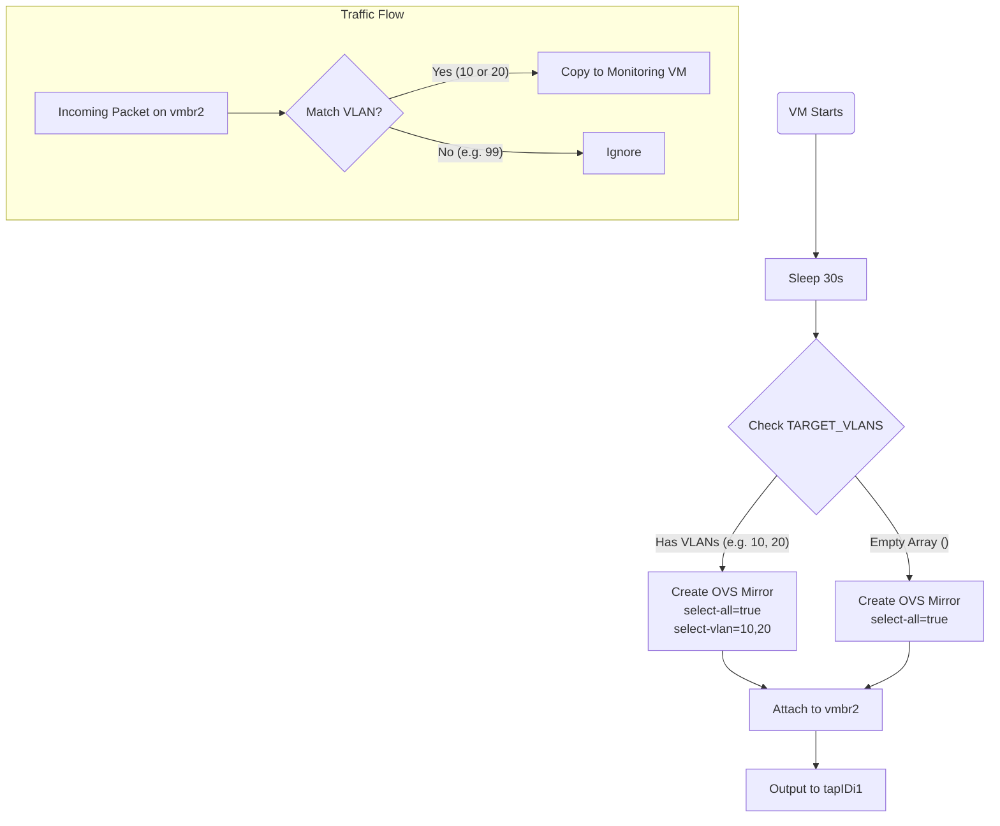

# Proxmox Advanced Port Mirroring (VLAN Filtered)

This version of the hookscript (`port-mirror-vlan.sh`) provides granular control over network monitoring by allowing you to filter mirrored traffic based on **VLAN IDs**.

## Why use this version?

In a production environment, mirroring *everything* (`select-all`) can overwhelm your IDS/IPS (Suricata, Zeek) with irrelevant traffic (e.g., storage replication, backup traffic, management flows). 

This script allows you to specify exactly which VLANs contain the traffic you want to inspect (e.g., "Guest Network", "DMZ").

## Configuration

Open `port-mirror-vlan.sh` and edit the user configuration section:

```bash
# ... inside port-mirror-vlan.sh ...

# The OVS Bridge to monitor
VM_BRIDGE="vmbr2"

# [ADVANCED] Target VLANs to monitor.
# Add VLAN IDs here (e.g., 10 20 30).
TARGET_VLANS=(10 20)
```

*   **`TARGET_VLANS=(10 20)`**: Only traffic tagged with VLAN 10 or 20 on `vmbr2` will be copied to the monitoring VM.
*   **`TARGET_VLANS=()`**: If left empty, it behaves like the standard script (Mirrors ALL traffic).

## Usage

1.  Copy to snippets: `cp port-mirror-vlan.sh /var/lib/vz/snippets/`
2.  Make executable: `chmod +x /var/lib/vz/snippets/port-mirror-vlan.sh`
3.  Apply to VM:
    ```bash
    qm set <VM_ID> --hookscript local:snippets/port-mirror-vlan.sh
    ```

## Logic Diagram (Mermaid)



