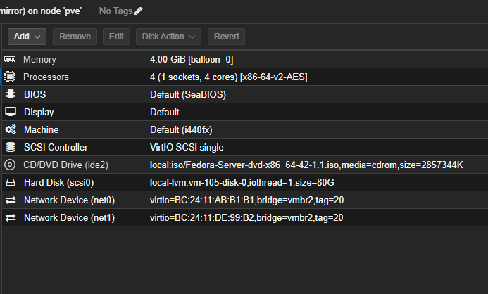
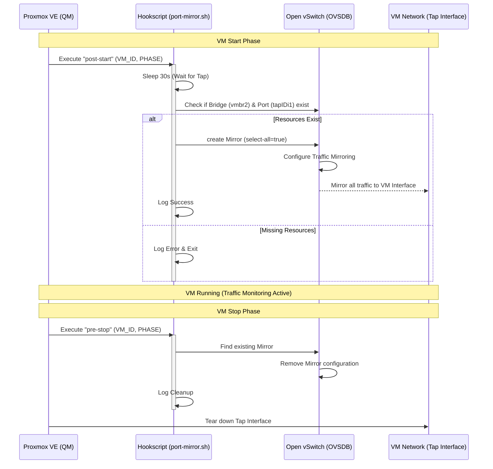

# Proxmox Security Architecture: OVS Port Mirroring

This project implements an automated traffic mirroring solution for Proxmox VE using Open vSwitch (OVS). It allows a specific Virtual Machine (VM) to act as a network monitor or Intrusion Detection System (IDS) by receiving a copy of all traffic flowing through a specific OVS bridge.

## `port-mirror.sh` Hookscript

The `port-mirror.sh` script is designed to be used as a Proxmox **Hookscript**. It automatically configures OVS port mirroring rules when the monitoring VM starts and cleans them up when it stops.

### How it Works

1.  **Trigger**: The script is triggered by Proxmox during VM lifecycle events (start, stop, etc.).
2.  **VM Identification**: It uses the `VM_ID` passed by Proxmox to uniquely identify the monitoring VM.
3.  **Bridge Target**: It targets `vmbr2` (configurable via `VM_BRIDGE` variable), which must be an OVS bridge.
4.  **Mirror Logic**:
    *   **Post-Start**: When the VM starts, the script waits 30 seconds (to ensure network interfaces are up). It then creates an OVS Mirror that selects **all traffic** (`select-all=true`) on the bridge and sends a copy to the VM's network interface (e.g., `tap<VMID>i1`).
    *   **Pre-Stop**: When the VM stops, the script removes the mirror configuration to prevent stale entries in the OVS database.

### Usage

1.  Place the script in `/var/lib/vz/snippets/` (or your preferred snippets directory) on the Proxmox host.
2.  Make it executable: `chmod +x port-mirror.sh`.
3.  Attach it to the monitoring VM:
    ```bash
    qm set <VM_ID> --hookscript local:snippets/port-mirror.sh
    ```

### Example VM Configuration (`/etc/pve/qemu-server/<VMID>.conf`)

Below is an example of a Proxmox VM configuration using this hookscript. Note the `hookscript` line and the multiple network interfaces on `vmbr2`.

```ini
agent: 1
balloon: 0
boot: order=scsi0;ide2;net0
cores: 4
cpu: x86-64-v2-AES
hookscript: local:snippets/port-mirror.sh
ide2: local:iso/Fedora-Server-dvd-x86_64-42-1.1.iso,media=cdrom,size=2857344K
memory: 4096
meta: creation-qemu=10.0.2,ctime=1760325267
name: mirror
net0: virtio=BC:24:11:AB:B1:B1,bridge=vmbr2,tag=20
net1: virtio=BC:24:11:DE:99:B2,bridge=vmbr2
# Note: 'tag=...' is OMITTED for net1 to accept ALL traffic (VLANs) from the mirror.
numa: 0
ostype: l26
scsi0: local-lvm:vm-105-disk-0,iothread=1,size=80G
scsihw: virtio-scsi-single
smbios1: uuid=8a13e510-dd21-450f-a19c-a03018422993
sockets: 1
vmgenid: 94a8be4f-d10f-4a42-8d6b-af409fd8a12f
```



### Guest OS Network Configuration

Inside the monitoring VM (e.g., Fedora, Ubuntu), the second network interface (corresponding to `net1`) receives the mirrored traffic.

**Recommended Setup:**
1.  **Interface State**: The interface must be **UP**.
2.  **IP Address**: Do **NOT** assign an IP address. This prevents the OS from attempting to route traffic or respond to ARP requests on the monitoring link (Stealth Mode).
3.  **Promiscuous Mode**: The interface should be in promiscuous mode to accept packets not destined for its own MAC address. Most tools (Suricata, Zeek, Wireshark) handle this automatically, but you can force it manually.

**Example (Linux / manual):**
```bash
# Bring interface up without IP
ip link set eth1 up

# Enable promiscuous mode (optional, tools usually do this)
ip link set eth1 promisc on
```

**Example (Netplan / Ubuntu):**
```yaml
network:
  version: 2
  ethernets:
    eth1:
      dhcp4: false
      dhcp6: false
      # No IP addresses assigned
```

### Execution Flow (Mermaid)

The following diagram illustrates the interaction between Proxmox, the Hookscript, and the Open vSwitch database during the VM lifecycle.



### Configuration Variables

*   `VM_BRIDGE`: The OVS bridge to attach the mirror to (Default: `vmbr2`).
*   `MIRROR_NIC_INDEXES`: Array of NIC indexes on the monitoring VM to send traffic to. `1` corresponds to `net1` (Default: `("1")`).
*   `LOGGING`: Path to the log file (Default: `/root/scripts/port-mirror.log`).
